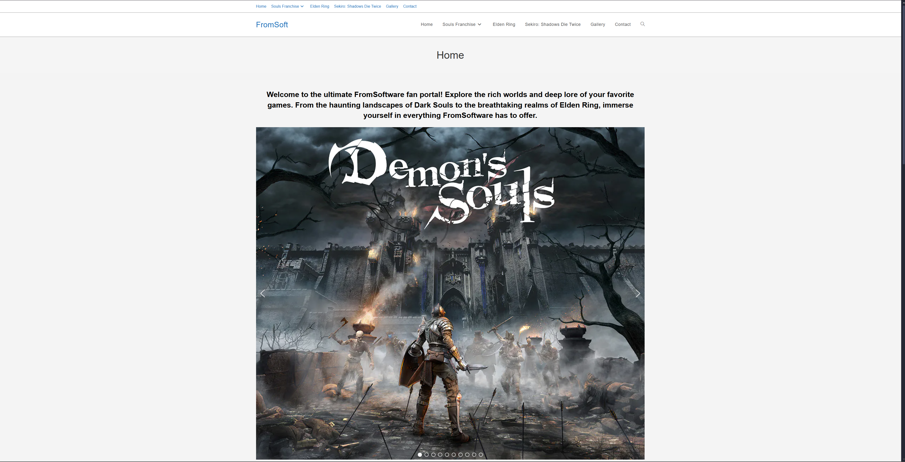
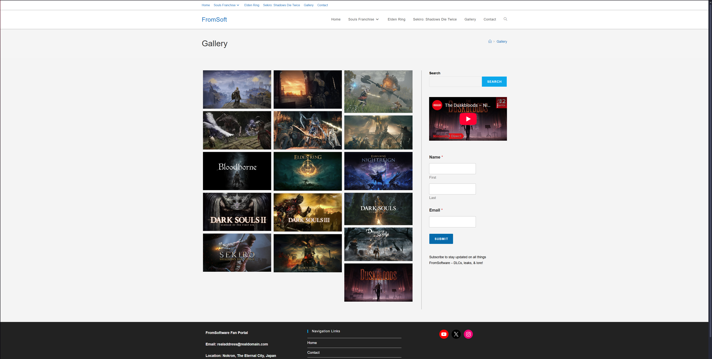
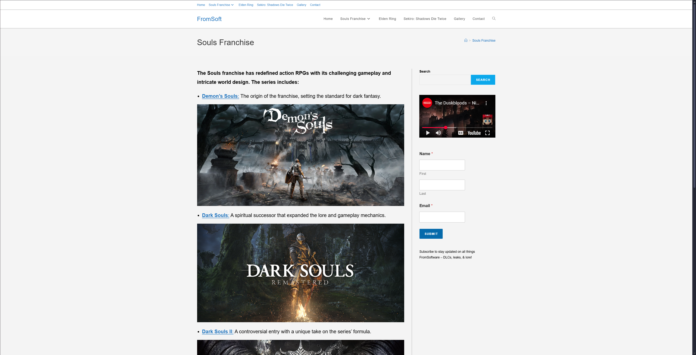
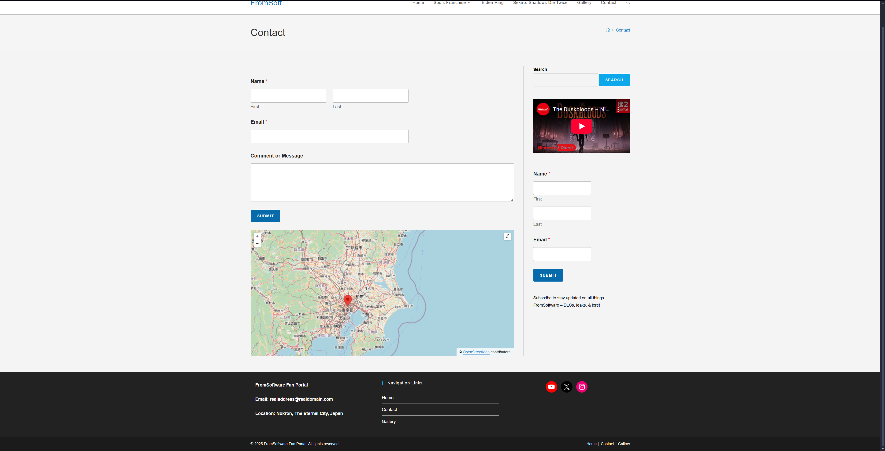

🔒 This project is unlicensed and intended for educational purposes only.

# 🖼️ FromSoftware fan portal WordPress website

A fan-made, locally hosted website built using WordPress, featuring content of FromSoftware but fully customized with a unique design and layout. This was a student project and my first ever WordPress project.

---

## 🚀 Features

- **🔝 Responsive Navbar/Header Menu**  
  A fixed navigation bar with dropdown menus for easy access to multiple sections and subpages.
- **🖼️ Image Slideshow**  
  A visually appealing slideshow/slider showcasing featured images with smooth transitions.
- **🖼️📸 Image Gallery with Lightbox**  
  A gallery layout displaying multiple images that open in a lightbox overlay for enhanced viewing.
- **📺 Sidebar with Embedded YouTube Video & ✉️ Subscribe Form**  
  A sidebar containing an embedded YouTube video alongside a subscription form to capture visitor emails.
- **📬 Contact Form with 🗺️ Google Maps Integration**  
  A user-friendly contact form complemented by an embedded Google Map showing the location.
- **🔗 Social Media Links**  
  Easily accessible social icons linking to your profiles for improved connectivity.
- **⚙️ General Website Essentials**  
  Responsive design, clean layout, SEO-friendly structure, and cross-browser compatibility.
- **🧩 Custom design using OceanWP theme**


---

## 🛠️ Technologies Used

- **WordPress** (locally hosted via XAMPP)
- **OceanWP Theme** with extensive customization
- **Custom CSS** tweaks for visual polish
- **Additional Plugins**:
  - *WPForms* (contact form)
  - *Envira Gallery* (for the gallery showcase)
  - *Smart Slider 3* (for the image slideshow)
  - *WP Google Maps* (map pin)

---

## 📦 Installation Instructions

This project is a locally hosted WordPress website. To set it up:

1. **Install XAMPP** (or another local web server with PHP and MySQL support).
2. Clone or download this repository into your htdocs directory.
3. Create a new MySQL database (e.g., wordpress) via phpMyAdmin.
4. Import the provided database dump file.
5. Edit wp-config.php to match your local database credentials:
   ```
      define('DB_NAME', 'wordpress');
      define('DB_USER', 'root');
      define('DB_PASSWORD', '');
      define('DB_HOST', 'localhost');
6. Start Apache and MySQL from your XAMPP control panel.
7. Visit http://localhost/your-project-folder in your browser.

⚠️ If the site appears blank or broken, ensure that all theme and plugin folders are in the correct location under wp-content/ .

⚠️ The images used in this website (shown in the screenshots) are not included in the repository.

⚠️ You need an existing installation of the WordPress environment to implement this project. If you don't have one, after installing XAMPP (or another local web server) download and install WordPress.

---

## 📸 Screenshots

<p align="center"><strong>Homepage</strong></p>



<p align="center"><strong>Gallery</strong></p>



<p align="center"><strong>Sample Page Layout</strong></p>



<p align="center"><strong>Contact Page</strong></p>


